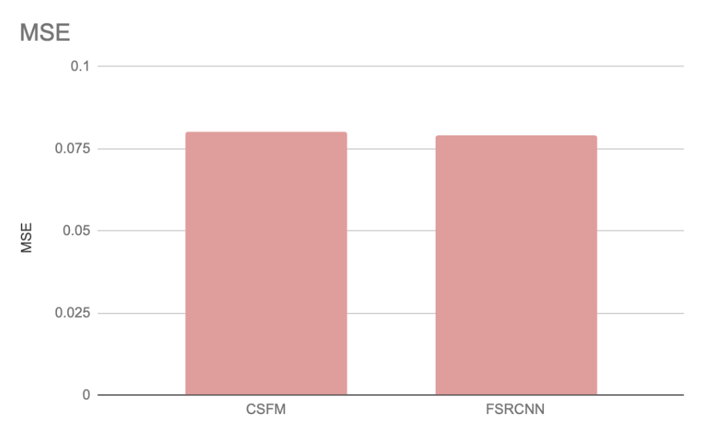

# Proba-V Super Resolution Challenge
##### Submission Report for Incubit Technical Assignment

The following report outlines the given problem, tackles data preprocessing and model selection and presents results. The report finishes off with a conclusion that also holds ideas for continued work.

## Problem Statement
Proba-V refers to the earth observation satellite that actively maps land cover and, more specifically, vegetation growth.

The satellite captures an average of 15 low resolution images of every covered location, which are to be 'super resolved' into high resolution images.

Of these 15 images, many are obscured by artefacts such as clouds, providing an additional challenge of how to circumvent such obscurations.

Each low resolution image is accompanied by a "Quality Map" in which black pixels indicate the position of an obscuration.

Thus we have two problems that ought to be tackled:

1. Interpolate obscured pixels and set up training data
2. Construct and test super resolution neural network architectures

## Data Approach
In this section the data preprocessing and training data set up are described.

### Filling out obscured pixels
Under normal circumstances a technique such as bilinear interpolation could be used to fill out obscured pixels of the low resolution images. However, as we have multiple images of the same scene, we can fill out obscured pixels with the mean or median of specific pixels across all of that scenes images.

The above image shows interpolation of obscured pixels using the median.

### Setting up training data

There are two training data set up options considered.

Firstly, option 1, we can use every single scene image as a data point. Or option 2, we use an aggregated image of each scene as a data point, leaving us with significantly less training data. For both cases, each low resolution image is paired with its respective high resolution counterpart.

Considering that images within a scene are the same with mostly minor aberrations, we opt for training using option 2. Option 1 is promising, as having multiple images with slight distortions for a single scene can help regularise models. However, this method greatly increases the size of our training data. So instead, we use the images aggregated for each scene as data points, and introduce aberrations by occasionally augmenting (rotating or mirroring) an image during training.

## Methodology

There have been many exciting neural network based super resolution models published in the past few years, making the decision of which to use quite difficult. For this reason, the constraints of the project are firstly inroduced.

### Project Constraints

* Computational Power:

  As the capacity of a neural network is increased, the number of parameters and computations thereof increases exponentially. With rather strict computational constraints on the local machine used for this project, this plays a large factor in model selection and capacity.

* Time Frame

  With near to unlimited computational power and enough time, incredible things can be achieved (e.g. [NVIDIA's StyleGAN](https://github.com/NVlabs/stylegan) ). However, with the limited time frame, training time and an upper bound to number of experiments had to be taken into account.

### Model selection

In the table below a few considered models and their papers are presented.

| Model Name | Model Type | Comments |
| ---------- |------------|----------|
| Fast Super Resolution CNN (FSRCNN)  | CNN | Straight forward to train and has seen promising results ([2015 Paper](http://mmlab.ie.cuhk.edu.hk/projects/SRCNN.html)) |
| Channel-Wise and Spatial Feature Modulation network (CSFM)  | CNN with feature-modulation memory | Establishes long-term skip connections ([2018 Paper](https://arxiv.org/pdf/1809.11130.pdf)) |
| Laplacian Pyramid Super-Resolution Network (LapSN)  | Progressive CNN | Improved parameter sharing which results in reduced computational complexity ([2018 Paper](https://arxiv.org/pdf/1710.01992.pdf)) |
| Super Resolution Generative Adversarial Network (SRGAN)  | GAN | Has seen impressive results. Difficult to train. ([2017 Paper](https://arxiv.org/pdf/1609.04802.pdf)) |

It was decided not to pursue the GAN as they are notoriously unstable to train and carry the risk of taking up a bulk amount of time that could be better spent elsewhere. If more time was available, the GAN would likely have been the first experiment.

### Experimental Setup

For our experiments, three selected architectures are tested against the baseline bilinear interpolation method.

* Our testing data is comprised of 20% of the data set

  (NOTE: Submissions to the competition have been closed, thus scoring/ranking on the leaderboard is not possible)

## Results

In the below figure a sample from the testing data used to make predictions with the chosen models and bicubic interpolation. Whilst all methods produced acceptable results, the two models did not significantly outperform the bicubic interpolation.

Looking closer at the zoomed in section of the image, both the FSRCNN and the CFSM models produced smoother edges compared to bicubic interpolation.

Additionally, both models bottomed-out at a similar MSE level, graphed in the below figure.

## Conclusion

Whilst the two models tested with the proposed data preprocessing technique did not achieve state-of-the-art results, the insight gained from these experiments can support future experiments in improving super resolved Proba-V images.

Firstly, we used single-image super resolution methods, however, this problem actually calls for a multi-image approach. [The first paper that ever tackled multi-image SR was published in March 2019 and achieves state-of-the-art results.](https://arxiv.org/abs/1903.00440) This would be an interesting approach to the Proba-V challenge, as it is one of the rare cases in which we actually have multiple images for a single scene at our disposal.

A second interesting approach, which to my best knowledge has never been proposed, would have been using an extension on the SRGAN architecture by making use of [progressive training](https://arxiv.org/abs/1710.10196).

It essentially involves slowly growing the resolution of a GAN. This allows the model to first learn low level features, which eases the learning of high level features later on. This architecture could be translated into a super resolution problem.

# Usage

1. Prepare data

   'python3 data_utilities.py' can be run and will download + prepare the data for you.

2. Modelling script

   Run 'python3 main.py' to train your model.

   Following arguments are important:

   * arch: Specifies model type ["FSRCNN" or "CSFM"]
   * train: True if train and False if testing
   * epoch: the number of iterations to train

Intermediate graphs will be saved to ./plots/ whilst testing results will be saved to ./result/
