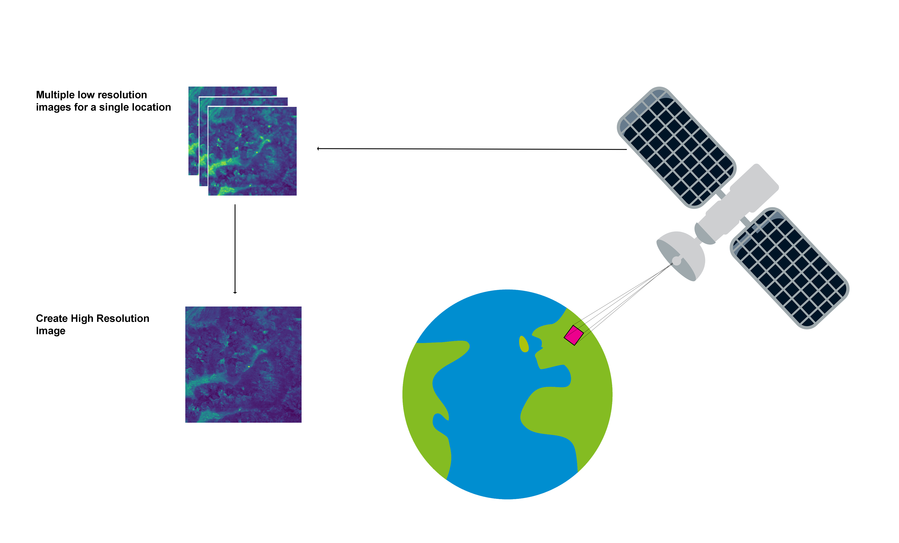
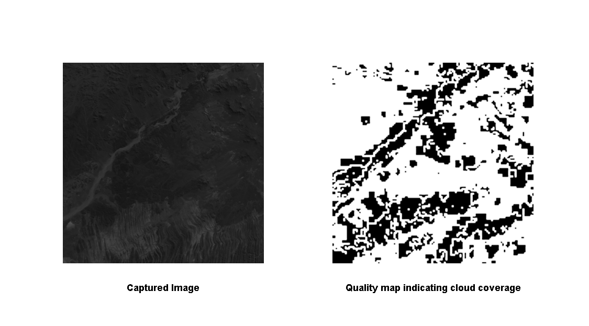
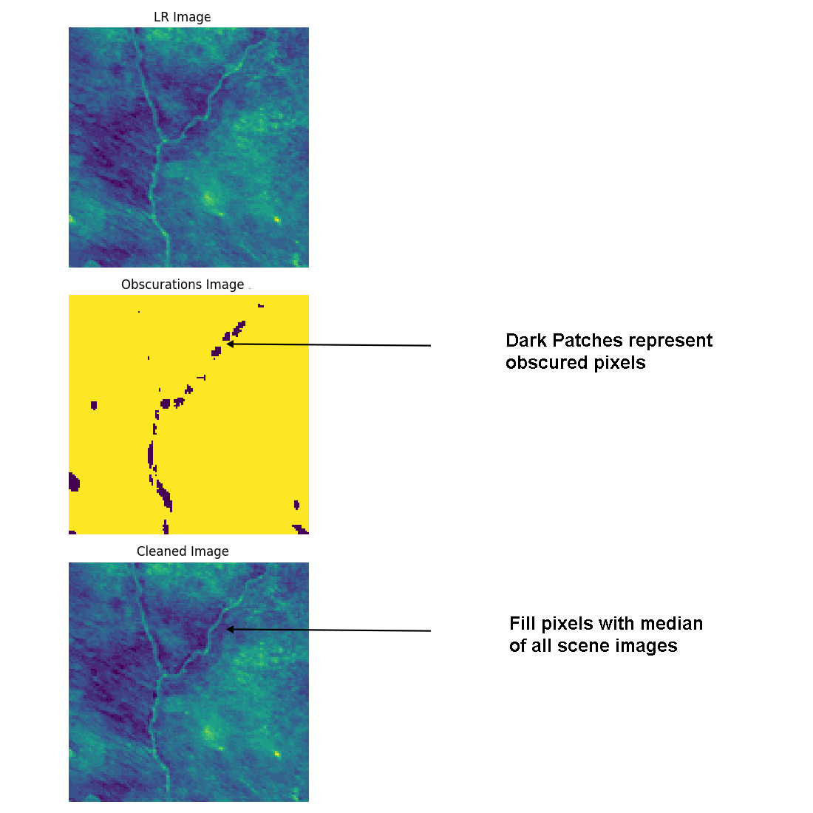
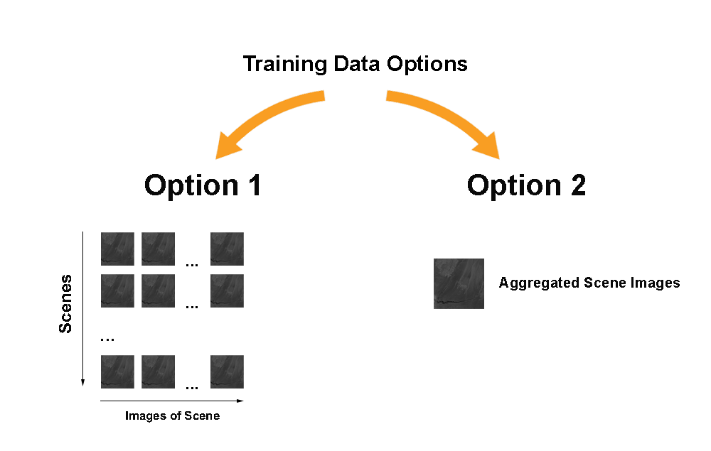
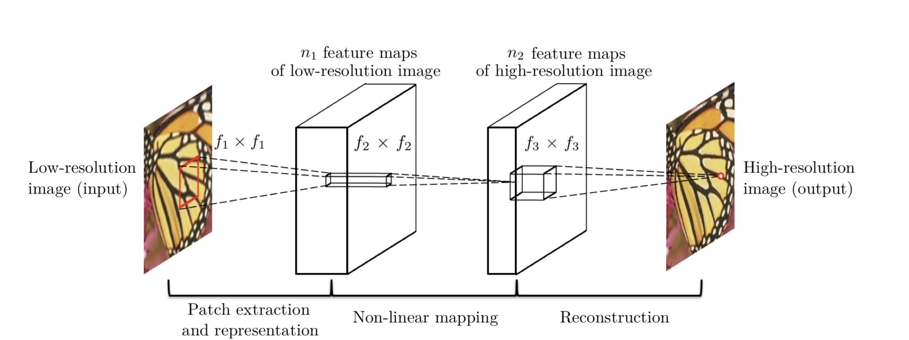
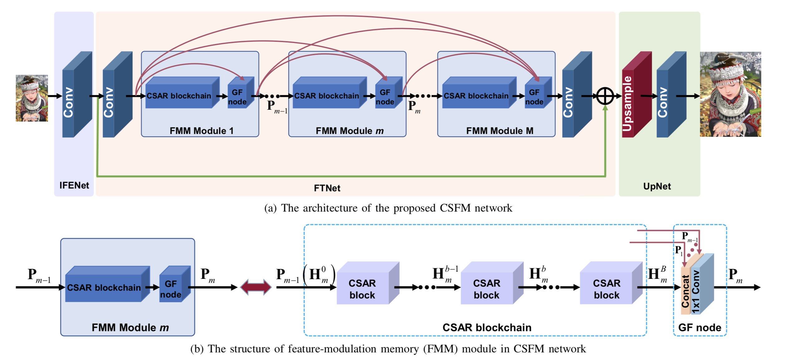
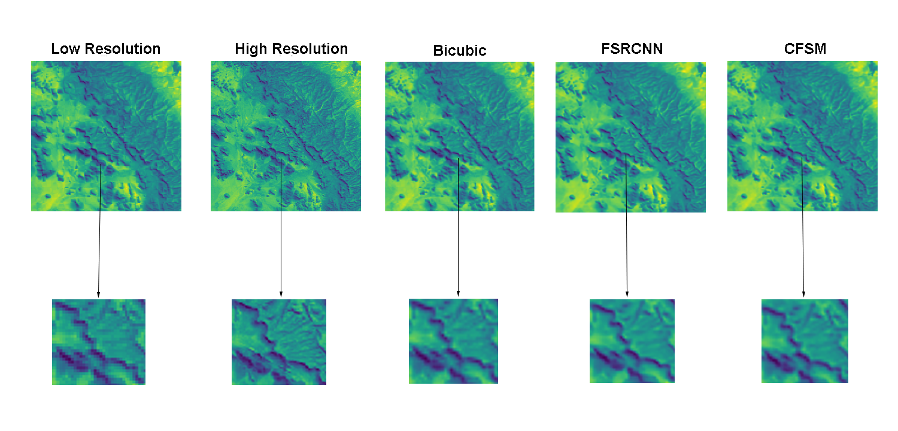
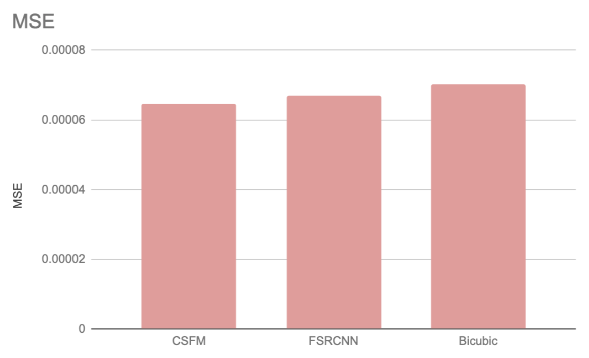
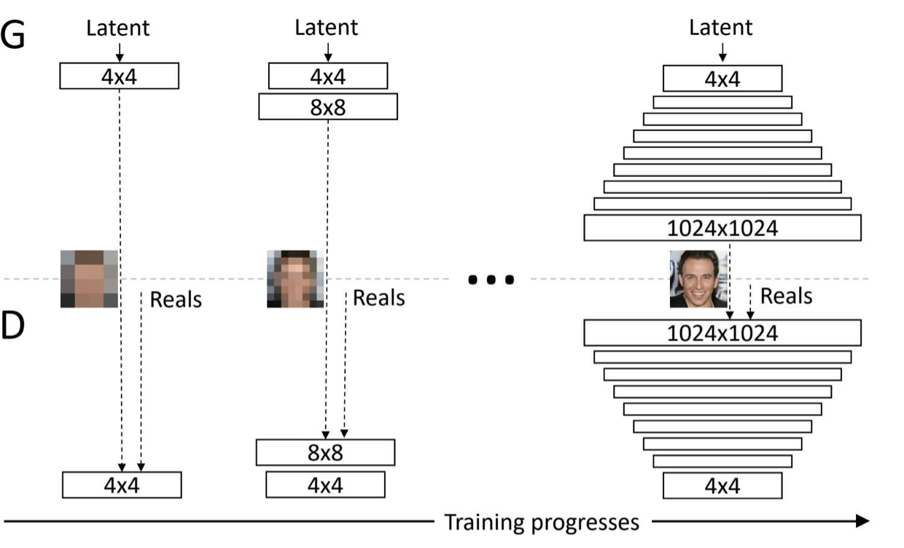

# Proba-V Super Resolution Challenge
##### Submission Report for Incubit Technical Assignment

The following report outlines the given problem, tackles data preprocessing, model selection and presents results. I'd like to draw special attention to the conclusion, which holds two interesting approaches that weren't tackled in these experiments due to time constraint.

## Problem Statement
Proba-V refers to the earth observation satellite that actively maps land cover and, more specifically, vegetation growth.

The satellite captures an average of 15 low resolution images of every covered location, which are to be 'super resolved' into high resolution images.

Of these 15 images, many are obscured by artefacts such as clouds, providing an additional challenge of how to circumvent such obscurations.

Each low resolution image is accompanied by a "Quality Map" in which black pixels indicate the position of an obscuration.

Thus we have two problems that ought to be tackled:

1. Interpolate obscured pixels and set up training data
2. Construct and test super resolution neural network architectures

## Data Approach
In this section the data preprocessing and training data set up are described.

### Filling out obscured pixels
Under normal circumstances, a technique such as bicubic interpolation could be used to fill out obscured pixels of the low resolution images. However, as we have multiple images of the same scene, we can fill out obscured pixels with the mean or median of specific pixels across all of that scenes images.

The above image shows interpolation of obscured pixels using the median.

### Setting up training data

Two training data setup options are considered.

* Option 1: we use every single scene image as an individual data point. This leaves us with a data set where many images are very similar and share the same label.

* Option 2: we use an aggregated image of each scene as a data point, leaving us with significantly less training data. However, we can virtually increase the training data and help regularisation by occasionally slightly augmenting an image during training through, for example, mirroring or rotation.

Considering that images within a scene are the same with mostly minor aberrations, we opt for training using option 2. Option 2 is computationally lighter by being smaller, [but can make up for it through data augmentation techniques](https://medium.com/nanonets/how-to-use-deep-learning-when-you-have-limited-data-part-2-data-augmentation-c26971dc8ced).

## Methodology

There have been many exciting neural network based super resolution models published in the past few years, making the decision of which to use quite difficult. For this reason, the constraints of the project are firstly introduced.

### Project Constraints

* Computational Power:

  As the capacity of a neural network is increased, the number of parameters and computations thereof increases exponentially. With rather strict computational constraints on the local machine used for this project, this plays a large factor in model selection and its respective capacity.

* Time Frame

  With near to unlimited computational power and enough time, incredible things can be achieved (e.g. [NVIDIA's StyleGAN](https://github.com/NVlabs/stylegan) ). However, with the limited time frame, training time and an upper bound to the number of experiments had to be taken into account.

### Model selection

In the table below a few considered models and their papers are presented.

| Model Name | Model Type | Comments |
| ---------- |------------|----------|
| Fast Super Resolution CNN (FSRCNN)  | CNN | Straight forward to train and has seen promising results ([2015 Paper](http://mmlab.ie.cuhk.edu.hk/projects/SRCNN.html)) |
| Channel-Wise and Spatial Feature Modulation network (CSFM)  | CNN with feature-modulation memory | Establishes long-term skip connections ([2018 Paper](https://arxiv.org/pdf/1809.11130.pdf)) |
| Laplacian Pyramid Super-Resolution Network (LapSN)  | Progressive CNN | Improved parameter sharing which results in reduced computational complexity ([2018 Paper](https://arxiv.org/pdf/1710.01992.pdf)) |
| Super Resolution Generative Adversarial Network (SRGAN)  | GAN | Has seen impressive results. Difficult to train. ([2017 Paper](https://arxiv.org/pdf/1609.04802.pdf)) |

It was decided not to pursue the GAN as they are notoriously unstable to train and carry the risk of taking up a bulk amount of time that could be better spent elsewhere. If more time was available, the GAN would likely have been one of the first experiments.

#### Final Selection

For the experiment we opt for the following two models:

1. **Fast Super Resolution CNN  (FSRCNN)**

  As Occam's Razor states, sometimes the simplest solution is the best. Although still widely in use, this is a relatively simple and straight-forward network consisting only of three parts.

  

  Namely a filter, a non-linear mapping and then reconstruction. It was decided to start-off with this simpler model and then work our way up to more complex models once the problem is better understood.

2. **Channel-Wise and Spatial Feature Modulation network (CSFM)**

  The second architecture is more complex and makes use of special ["FMM" modules](https://arxiv.org/pdf/1809.11130.pdf) for improved feature extraction and [skip connections](https://towardsdatascience.com/residual-blocks-building-blocks-of-resnet-fd90ca15d6ec), which help carry spatial information to later layers. This information often gets lost when a CNN is deep.
  

These two models make an interesting comparison as their performance will tell us a lot about the data. For one, we get an indication from the FSRCNN as to whether the problem needs larger model capacity. From the second model we get information as to whether the carrying of long-term information across the network is useful for our case in which spatial features might be vague.

### Experimental Setup

For our experiments, three selected architectures are tested against the baseline bicubic interpolation method.

* Our testing data is comprised of 20% of the data set

  (NOTE: Submissions to the competition have been closed, thus scoring/ranking on the leaderboard is not possible)

## Results

In the below figure a sample from the testing data used to make predictions with the chosen models and bicubic interpolation. 

Looking closer at the zoomed in section of the image, both the FSRCNN and the CFSM models produced smoother edges compared to bicubic interpolation.

We could measure the performance of the different techniques by calculating the mean squared error (MSE) of the test set for every model. The MSE can be interpreted as how close a resolved image is to its high resolution partner.

We see that both models outperformed bicubic sampling. This is a very positive result as beating bicubic sampling was the aim of the Proba-V challenge.

## Conclusion

Our models both performed well in comparison to bicubic sampling and the insight gained from these experiments can support future experiments in improving super resolved Proba-V images.

* It seems that the long-term information flow of the CSFM model benefits the problem domain. Further investigation into the effects of skip connection and model depth would be interesting.

* Our approach did not account for sub-pixel shifts. A possible experiment might be to [register](https://arxiv.org/pdf/1809.11130.pdf) the lr/hr pairs with one another in order to be certain that the low and high resolution pairs are perfectly aligned. This could potentially ease learning.

* Additionally, we used single-image super resolution methods, however, this problem actually calls for a multi-image approach. [The first paper that ever tackled multi-image SR with deep neural networks was published in March 2019 and achieves state-of-the-art results.](https://arxiv.org/abs/1903.00440) This would be an interesting approach to the Proba-V challenge, as it is one of the rare cases in which we actually have multiple images for a single scene at our disposal.

* A second interesting approach, **which to my best knowledge has never been proposed**, would have been using an extension on the SRGAN architecture by making use of [progressive training](https://arxiv.org/abs/1710.10196).

It essentially involves slowly growing the resolution of a GAN. This allows the model to first learn low level features, which eases the learning of high level features later on. This architecture could be translated into a super resolution problem and would make an incredibly exciting research topic.

# Usage

1. Prepare data

   'python3 data_utilities.py' can be run and will download + prepare the data for you.

   Any customisation thereof can be done through variables defined at the bottom of the script.

2. Modelling script

   Run 'python3 main.py' to train your model.

   After training is complete, testing output will automatically be saved. Intermediate graphs will be saved to ./plots/ whilst testing results will be saved to ./result/

   Following arguments are important:

   * --arch: Specifies model type ["FSRCNN" or "CSFM"]
   * --train: True if train and False if testing
   * --epoch: the number of iterations to train
   * --learning_rate: LR for Adam optimizer
   * --batch_size: default is 32

#### References:
* [Embiggen module](https://github.com/lfsimoes/probav) was released by a participant of the proba-v challenge to help the data process. We use it for importing the data paths.
* https://github.com/igv/FSRCNN-TensorFlow/blob/master/FSRCNN.py
* https://github.com/igv/FSRCNN-TensorFlow/blob/master/CSFM.py
